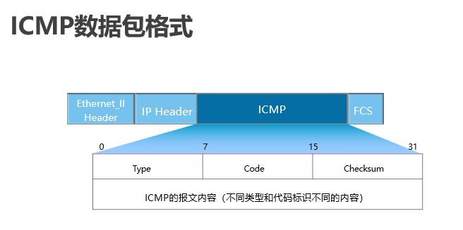
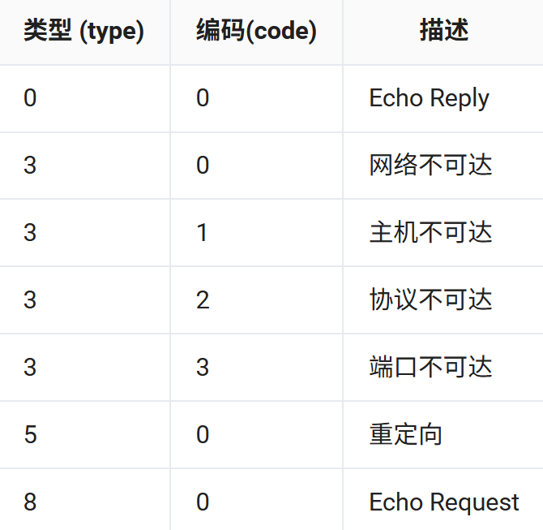

## 概述
1. 互联网控制消息协议（Internet Control Message Protocol），是网络层的协议。
2. 用于 TCP/IP 网络中发送控制消息，确认 IP 包是否成功送达，以及提供可能发生在通信环境中的各种问题反馈。

## 数据包


### type+code
typ e和 code 的不同组合可以表示不同功能的ICMP报文


## 应用
### ping
测试网络连通性
```
ping + 目的IP(域名) + 选项（-a、-c 等等）
```
1. ping -a：指定报文的源 IP，默认为出接口 IP 地址
2. ping -c：指定报文发送的数量，默认为5
3. ping -t：持续发送报文
4. ping -h：指定 TTL 的值，默认值为255
5. ping -i：指定发送 ICMP 报文的接口
### tracert
用于跟踪数据包的转发路径。一般用于排障
```
tracert + 选项（-a、-f、-m等等） + 目的IP地址
```
1. tracert -a 指定源IP
2. tracert -f 指定初次 TTL 的值
3. tracert -q 指定发送单个报文的次数，默认为 3
4. tracert -m 最大的 TTL 值，默认为 30