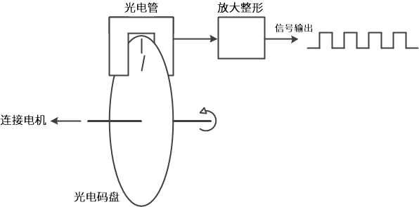
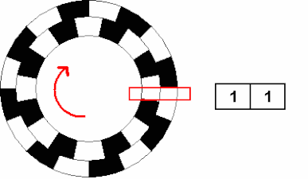
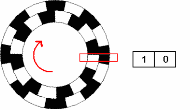
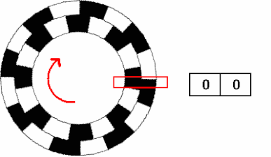

## 概述（pending）
1. 一种用来测量机械旋转或位移的传感器。能够测量机械部件在旋转或直线运动时的位移位置或速度等信息，并将其转换成一系列电信号。
2. 根据检测原理，可分为光学式、磁式、感应式和电容式。根据内部机械结构的运动方式，可分为线性编码器和旋转编码器。根据其刻度实现方法及信号输出形式，又可分为增量式、绝对式以及混合式三种。
## 信号输出分类
### 增量式编码器
1. 将设备运动时的位移信息变成连续的脉冲信号，脉冲个数表示位移量的大小。
2. 一般会把这些信号分为通道 A 和通道 B 两组输出，并且这两组信号间有90°的相位差。同时采集这两组信号就可以知道速度和方向。
3. 除了通道 A/B 以外，很多增量式编码器还会设置一个额外的通道 Z 输出信号，用来表示编码器特定的参考位置，转一圈 Z 轴信号才会输出一个脉冲。
### 绝对式编码器
1. 将设备运动时的位移信息通过二进制编码的方式变成数字量直接输出。
2. 码盘利用若干透光和不透光的线槽组成一套二进制编码，这些二进制码与编码器转轴的每一个不同角度是唯一对应的，读取这些二进制码就能知道设备的绝对位置。
3. 一般常用自然二进制、格雷码或者BCD码等编码方式。
### 混合式绝对式编码器
输出两组信息：
1. 一组信息用于检测磁极位置，带有绝对信息功能
2. 另一组则和增量式编码器的输出信息完全相同

## 旋转编码器原理
1. 内部大都由码盘、光电检测装置和信号处理电路等部分构成。
2. 码盘上刻了若干圈线槽，线槽等距并且可透光，旋转时就会周期性的透过和遮挡来自光电检测装置的光线，检测装置就会周期性的生成若干电信号。
3. 这些电信号通常比较微弱，需要加入一套处理电路对信号进行放大和整形，最后把信号整形为脉冲信号并向外输出。\

## 增量式编码器
### 原理

### 基本参数

## 绝对式编码器
### 原理

### 基本参数
