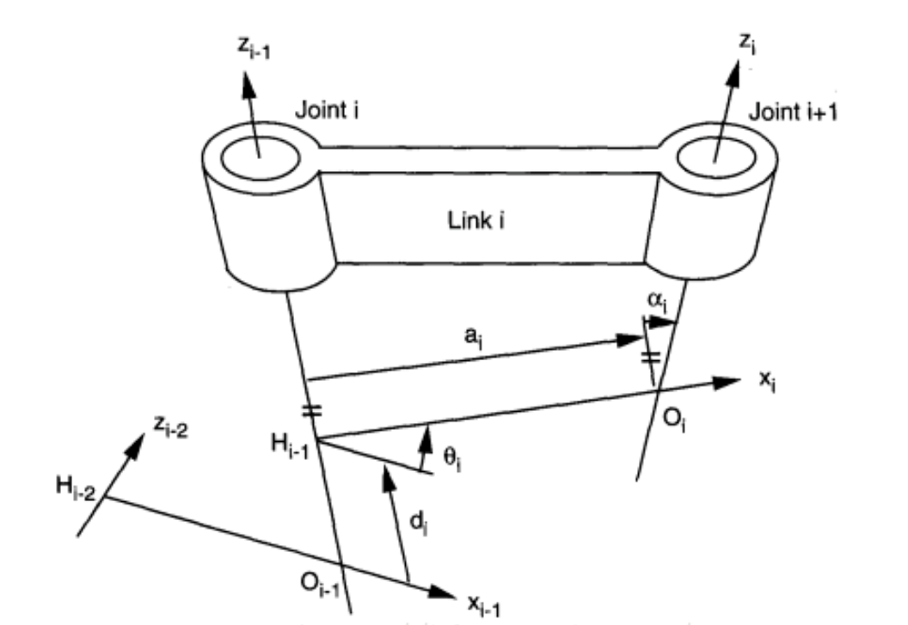
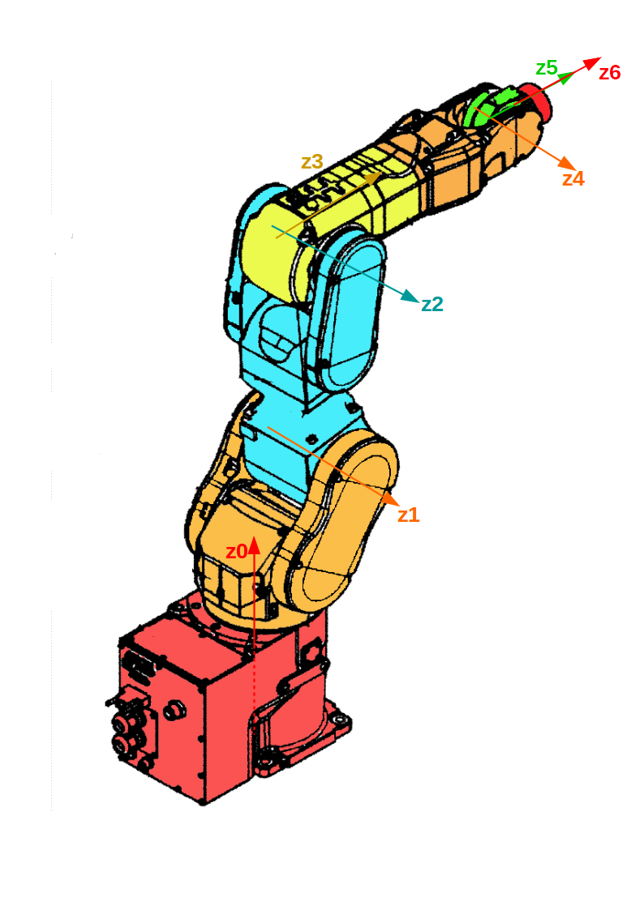
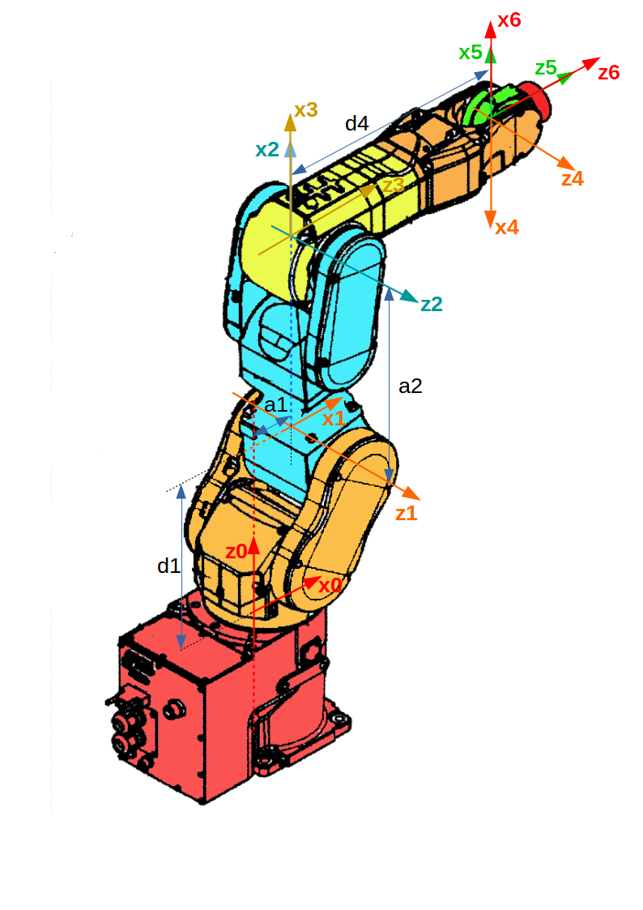

## 概述
1. 根据已知的关节空间构型，计算出末端执行器在任务空间中的位姿。
2. 是一个直接、确定性的映射过程。对于给定的任意一组关节变量，总能计算出唯一确定的末端执行器位姿。
## Denavit-Hartenberg (D-H) 参数法
行业中最标准、最系统化的方法
### 齐次变换矩阵
$$T = \begin{bmatrix}
    R & p \\
    0 & 1
\end{bmatrix} = \begin{bmatrix}
    r_{11} & r_{12} & r_{13} & p_x \\
    r_{21} & r_{22} & r_{23} & p_y \\
    r_{31} & r_{32} & r_{33} & p_z \\
    0 & 0 & 0 & 1
\end{bmatrix}$$
$R$ 是 $3 \times 3$ 旋转矩阵，描述了坐标系之间的相对姿态；$p$ 是 $3 \times 1$ 平移向量，描述了坐标系原点之间的相对位置。
### D-H 参数

1. 连杆长度 $a_i$：沿两关节轴公垂线（即新的 $x_{i}$ 轴）方向，从 $z_{i-1}$ 轴到 $z_i$ 轴的距离。
2. 连杆扭角 $\alpha_i$：绕公垂线（$x_i$ 轴）旋转，使得 $z_{i-1}$ 轴与 $z_i$ 轴平行的角度。
3. 连杆偏距 $d_i$：沿 $z_{i-1}$ 轴方向，从 $x_{i-1}$ 轴到 $x_i$ 轴的距离。对于移动关节，此参数是变量。
4. 关节转角 $\theta_i$：绕 $z_{i-1}$ 轴旋转，使得 $x_{i-1}$ 轴与 $x_i$ 轴平行的角度。对于旋转关节，此参数是变量
### 坐标系确立原则
1. 对杆件进行编号。底座是 Link0，照此依次为杆件进行编号
2. 对关节进行编号。关节 i 连接 link i 和 link i-1
3. Z 轴：$Z_i$ 轴与第 i+1 关节轴固结\
（1）如果是旋转关节，则垂直于关节的旋转平面，按右手定则大拇指指向为正方向\
（2）如果是伸缩关节，则沿关节的伸缩直线运动的正方向\

4. X 轴：\
（1）若两 Z 轴不平行不相交，则沿两 Z 轴的公垂线方向为 X 轴正方向\
（2）若两 Z 轴平行，则按任一公垂线为 X 轴\
（3）若两 Z 轴相交，则按两轴的叉积方向为 X 轴\

5. Y 轴：按右手定则确定
### 全局变换矩阵
1. 根据四个 D-H 参数，从坐标系 $\{i-1\}$ 到坐标系 $\{i\}$ 的变换矩阵 $A_i$ 可以表示为
$$A_i = \begin{bmatrix}
    \cos\theta_i & -\sin\theta_i\cos\alpha_i & \sin\theta_i\sin\alpha_i & a_i\cos\theta_i \\
    \sin\theta_i & \cos\theta_i\cos\alpha_i & -\cos\theta_i\sin\alpha_i & a_i\sin\theta_i \\
    0 & \sin\alpha_i & \cos\alpha_i & d_i \\
    0 & 0 & 0 & 1
\end{bmatrix}$$
2. 正运动学方程，即从基座 $\{0\}$ 到末端执行器 $\{n\}$ 的总变换矩阵 $T_0^n$，通过将所有单个连杆的变换矩阵依次相乘得到
$$T_0^n = A_1(\theta_1, d_1) A_2(\theta_2, d_2) \cdots A_n(\theta_n, d_n)$$