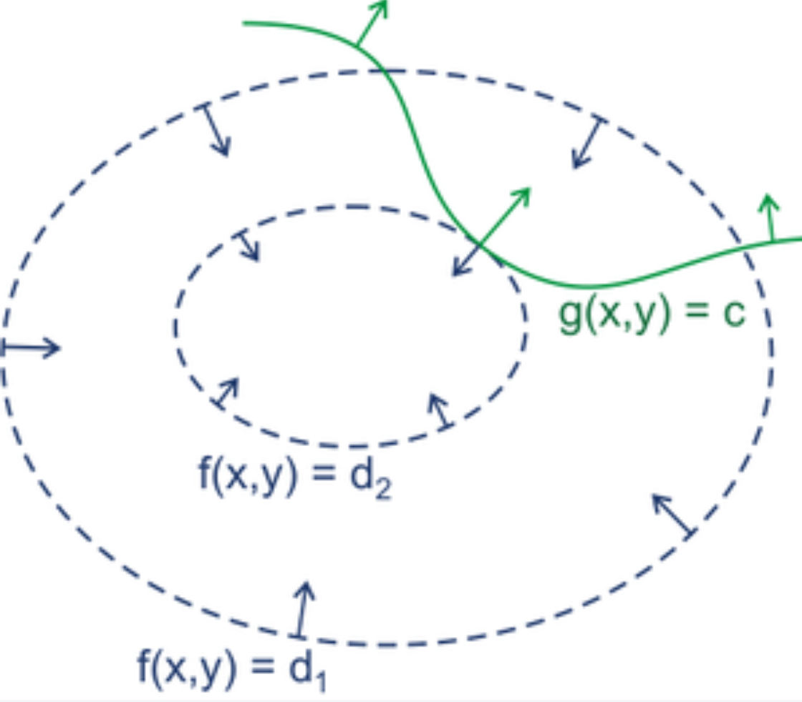

## 概述
1. 一种在数学、物理和工程中寻找带约束条件的函数极值的强大工具
2. 核心思想：在极值点，目标函数的等高线（面）与约束条件的等高线（面）必定相切
## 算子

### 相切的意义
1. $f$ 的梯度 $\nabla f$ 始终垂直于 $f$ 的等高线，$g$ 的梯度 $\nabla g$ 始终垂直于 $g$ 的等高线
2. 两个函数在切点的法向量也必须平行
### 引出
两个向量平行，意味着它们只相差一个标量（常数）倍数，把这个倍数称为 $\lambda$（拉格朗日乘子）
$$\nabla f(x, y) = \lambda \nabla g(x, y)$$
## 拉格朗日函数
### 定义
为了方便求解构造一个辅助函数，称为拉格朗日函数
$$L(x, y, \lambda) = f(x, y) - \lambda (g(x, y) - c)$$
### 求解过程
1. 把 $x, y, \lambda$ 都看作自变量。现在来求 $L$ 的无约束极值，即解所有偏导数为 0 的点：
$$\nabla L = 0$$
2. 可以得到
$$\frac{\partial L}{\partial x} = \frac{\partial f}{\partial x} - \lambda \frac{\partial g}{\partial x} = 0$$
$$\frac{\partial L}{\partial y} = \frac{\partial f}{\partial y} - \lambda \frac{\partial g}{\partial y} = 0$$
$$\frac{\partial L}{\partial \lambda} = -(g(x, y) - c) = 0$$
3. 把一个有约束的 $f$ 极值问题，转化成了一个无约束的 $L$ 极值问题，解上面三个方程即可得到最优解
## 扩展：多个约束条件
### 约束条件
假设想最小化 $f(x, y, z)$，同时满足两个约束
$$g_1(x, y, z) = c_1$$
$$g_2(x, y, z) = c_2$$
### 求解过程
1. 为每一个约束引入一个独立的拉格朗日乘子
$$L(x, y, z, \lambda_1, \lambda_2) = f(x, y, z) - \lambda_1(g_1 - c_1) - \lambda_2(g_2 - c_2)$$
2. 核心原理 $\nabla f = \lambda \nabla g$ 也随之扩展为
$$\nabla f = \lambda_1 \nabla g_1 + \lambda_2 \nabla g_2$$
3. 以下步骤与上相同