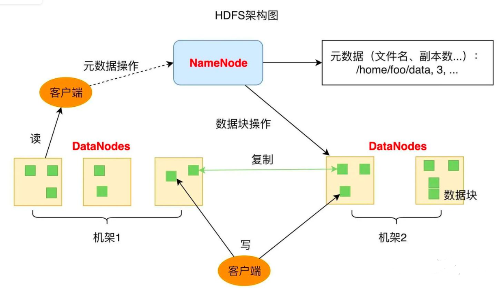
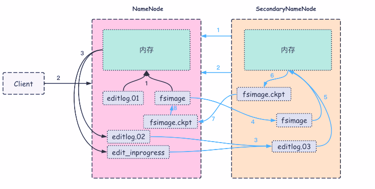
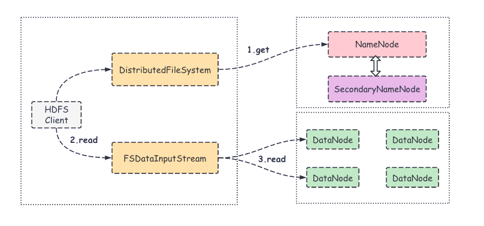
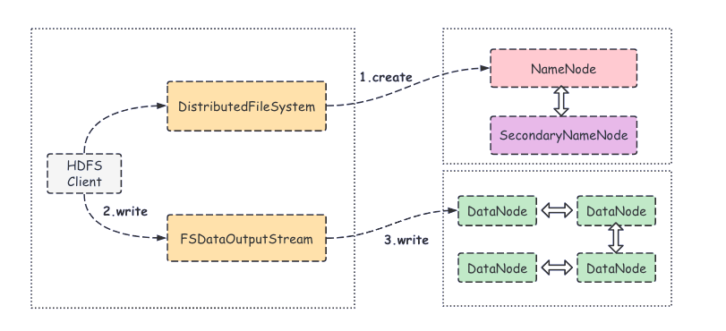

## 概述
全称 Hadoop Distributed File System（分布式文件系统），旨在解决海量数据的存储问题。
## 架构
1. Client：客户端，HDFS 提供统一的文件系统访问接口和非常多的客户端，包括命令行接口、Java API、Thrift接口、Web界面等。
2. NameNode：元数据节点，负责管理文件系统的元数据（比如文件和目录的树状结构，文件块的位置、用户权限等）。主要有以下三个功能：\
（1）接收 Client 发送过来的读写请求\
（2）管理和维护HDFS的命名空间: 元数据是以镜像文件(fsimage)和编辑日志(editlog)两种形式存放在本地磁盘上的，可以记录 Client 对 HDFS 的各种操作，比如修改时间、访问时间、数据块信息等\
（3）监控和管理DataNode：负责监控集群中DataNode的健康状态，一旦发现某个DataNode宕掉，则将该 DataNode 从 HDFS 集群移除并在其他 DataNode 上重新备份该 DataNode 的数据(该过程被称为数据重平衡，即rebalance)，以保障数据副本的完整性和集群的高可用性。
3. DataNode：数据存储节点，文件是由数据块组成的，DataNode 负责具体的数据存储，并将数据的元信息定期汇报给 NameNode，并在其指令下完成数据的 I/O 操作。\
数据块就是一个普通文件，可以在DataNode存储块的对应目录下看到（默认在$(dfs.data.dir)/current的子目录下），块的名称是 blk_ID，其大小可以通过dfs.blocksize设置，默认为128MB。
4. Secondary NameNode：备份节点，在NameNode宕机后，其会接替 NameNode 的工作，负责整个集群的管理。并且出于可靠性考虑，其与 NameNode 节点运行在不同的机器上，且内存要一样大。\
同时，为了减小压力，NameNode 并不会自动合并 HDFS 中的元数据镜像文件 (fsimage) 和编辑日志 (editlog)，而是将该任务交由 Secondary NameNode 来完成，在合并完成后将结果发送到NameNode, 并再将合并后的结果存储到本地磁盘。\

## 工作机制
1. 数据备份\
将同一个数据块对应的数据副本（副本个数可设置，默认为3）存放在多个不同的 DataNode 上。在某个 DataNode 节点宕机后，HDFS 会从备份的节点上读取数据。
2. NameNode\
（1）启动后,会将镜像文件(fsimage)和编辑日志(editlog)加载进内存中\
（2）客户端发来增删改查等操作的请求\
（3）记录下操作，并滚动日志，然后在内存中对操作进行处理
3. SecondaryNameNode\
（1）当编辑日志数据达到一定量或每隔一定时间，就会触发 2NN 向 NN 发出 checkpoint 请求\
（2）如果发出的请求有回应，2NN 将会请求执行 checkpoint 请求\
（3）2NN 会引导 NN 滚动更新编辑日志，并将编辑日志复制到 2NN 中\
（4）同编辑日志一样，将镜像文件复制到 2NN 本地的 checkpoint 目录中\
（5）2NN 将镜像文件导入内存中，回放编辑日志，将其合并到新的fsimage.ckpt\
（6）2NN 将 fsimage.ckpt 压缩后写入到本地磁盘，再将 fsimage.ckpt 传给 NN\
（7）NN 会将新的 fsimage.ckpt 文件替换掉原来的 fsimage，然后直接加载和启用该文件\

## 文件读取流程
\

1. 客户端调用 FileSystem 对象的open()方法，获取一个分布式文件系统（DistributedFileSystem）实例
2. 将所要读取文件的请求发送给 NameNode，然后 NameNode 返回文件数据块所在的 DataNode 列表（是按照 Client 距离 DataNode 网络拓扑的远近进行排序的），同时也会返回一个文件系统数据输入流（FSDataInputStream）对象
3. 客户端调用 read() 方法，会找出最近的 DataNode 并连接
4. 数据从 DataNode 流向客户端

## 文件写入流程
\

1. 客户端通过调用分布式文件系统（DistributedFileSystem）的 create() 方法创建新文件
2. 分布式文件系统将文件写入请求发送给 NameNode，此时 NameNode 会做各种校验，比如文件是否存在，客户端有无权限去创建等；
3. 如果校验不通过则会抛出I/O异常。如果校验通过，NameNode 会将该操作写入到编辑日志中，并返回一个可写入的 DataNode 列表，同时，也会返回文件系统数据输出流（FSDataOutputStream）的对象
4. 客户端在收到可写入列表之后，会调用 write() 方法将文件切分为固定大小的数据包，并排成数据队列
5. 数据队列中的数据包会写入到第一个 DataNode，然后第一个 DataNode 会将数据包发送给第二个 DataNode，依此类推。
6. DataNode 收到数据后会返回确认信息，等收到所有 DataNode 的确认信息之后，写入操作完成。