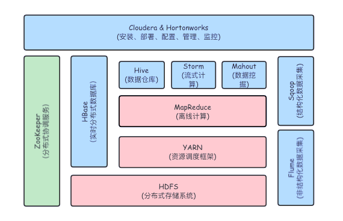

## 
一个开源的分布式计算框架，用于处理和存储大规模数据集，由 Apache Software Foundation维护。\

## 核心组件
1. HDFS\
数据存储层,负责将大量数据分块存储到集群中的不同节点上，从而实现分布式保存和冗余备份。数据被切分成小块，并复制到多个节点，以防硬件故障。
2. MapReduce\
分布式计算模型,将处理大规模数据集的任务分发到多个节点，允许并行处理。MapReduce由两个阶段组成：Map阶段负责将任务分解为多个小任务；Reduce阶段负责对小任务的结果进行汇总。
3. YARN\
资源管理层，负责管理和调度集群中的计算资源。允许多个作业在同一 Hadoop 集群上并行执行，这大大提高了  Hadoop 集群的利用率和扩展能力。
4. Hadoop Common\
是 Hadoop的核心库，提供必要的工具和实用程序，用于支持其他 Hadoop模块。