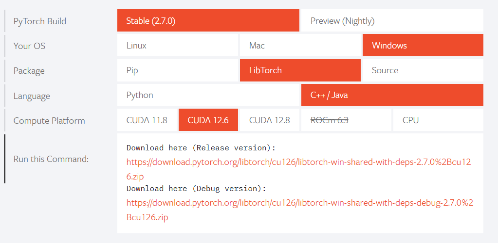
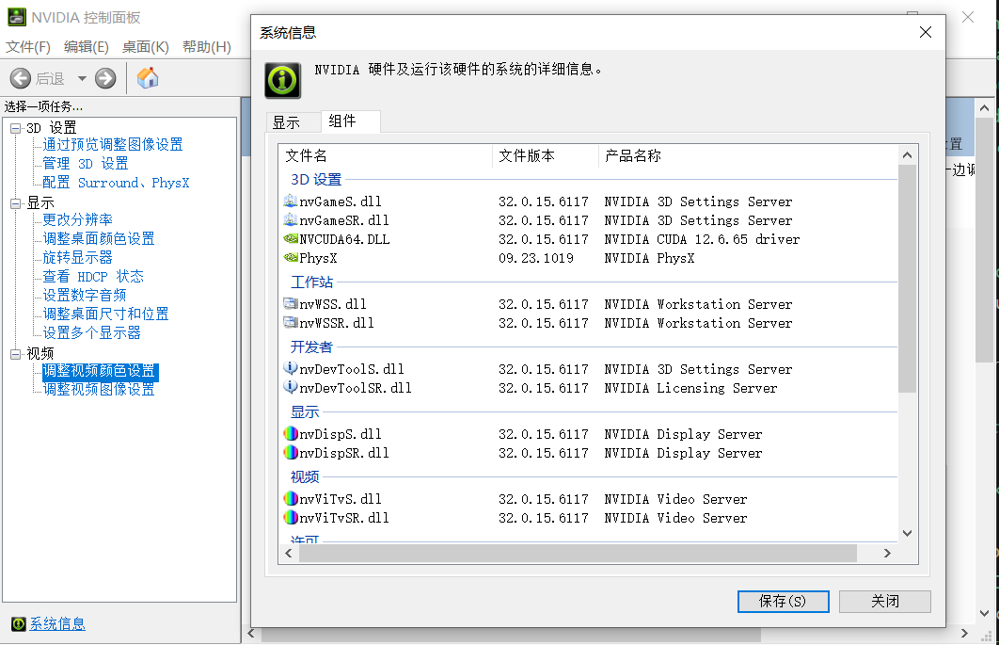
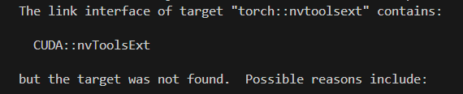
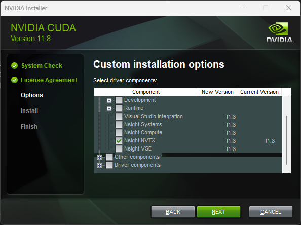

## Pytorch
1. 官网下载\
https://pytorch.org/
 

2. 将以下路径添加到系统环境变量\
```
C:\ruanjian\libtorch\bin
C:\ruanjian\libtorch\lib
```
3. C++ 库只支持 MVSC 编译
## CUDA
1. 查看最高兼容版本\
 

2. 官网下载，选择 Pytorch 对应版本\
https://developer.nvidia.com/cuda-toolkit-archive
3. 验证，打开命令行输入\
``nvcc -V``
## cudnn
1. 官网下载\
https://developer.nvidia.com/rdp/cudnn-archive
2. 解压后将对应的文件夹复制到 CUDA 相应文件夹
## 测试
1. CMakeLists.txt
```
set(Torch_DIR C:/ruanjian/libtorch/share/cmake/Torch)
find_package(Torch REQUIRED)
set(CMAKE_CXX_FLAGS "${CMAKE_CXX_FLAGS} ${TORCH_CXX_FLAGS}")

include_directories(${TORCH_INCLUDE_DIRS})

add_executable(${PROJECT_NAME} main.cpp)

target_link_libraries(${PROJECT_NAME} ${TORCH_LIBRARIES})
set_property(TARGET ${PROJECT_NAME} PROPERTY CXX_STANDARD 17)
```
2. main.cpp
```
#include <iostream>
#include <torch/torch.h>

using namespace std;

int main(){
    torch::Tensor tensor = torch::rand({2, 3});
    std::cout << tensor << std::endl;
    return 0;
}
```
## CUDA::nvToolsExt报错
 

1. 原因：Nvidia stopped including NVTX as a compiled library in CUDA 12.x+ with NVTX version 3. Unfortunately, the LibTorch developers did not have time to account for this for cmake, which is still looking for the compiled library.
2. 解决方法1：使用 cuda 11.8 安装器安装 Nsight NVTX 组件\
 

1. 解决方法2：修改 LibTorch 提供的CMake文件\
找到文件 C:\dev\libtorch\share\cmake\Caffe2\public\cuda.cmake
```
在第 59 行 find_package(CUDAToolkit REQUIRED) 之后添加两行内容：
add_library(CUDA::nvToolsExt INTERFACE IMPORTED)
set_property(TARGET CUDA::nvToolsExt APPEND PROPERTY INTERFACE_INCLUDE_DIRECTORIES "${CUDAToolkit_INCLUDE_DIRS}")
```